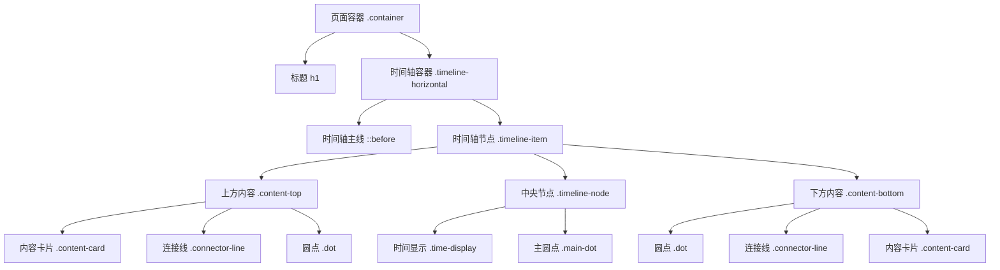
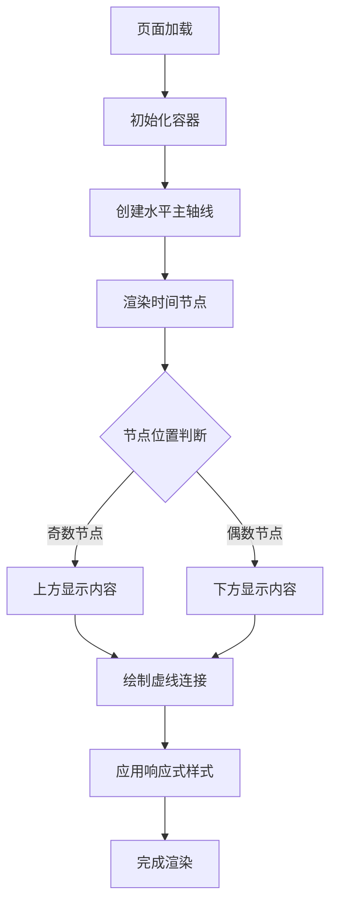
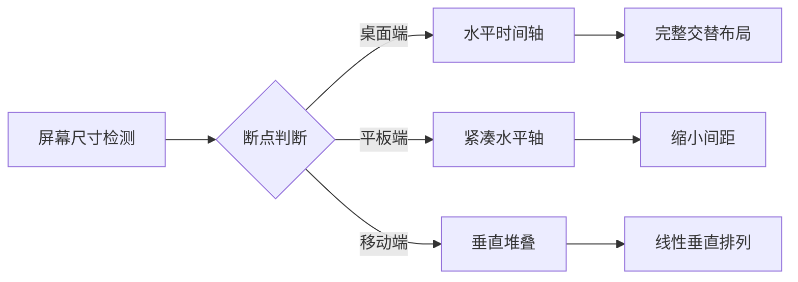
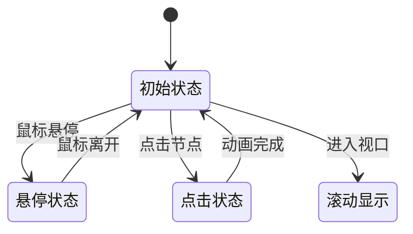

# 水平时间轴组件设计文档

## 概述

该项目旨在创建一个水平方向的时间轴组件，实现内容上下交替展示的布局效果。时间轴组件将放置在 `html-demos` 目录下，命名为 `timeline-hor-demo.html`，提供直观的时间线展示功能。

## 技术栈

- **HTML5**: 页面结构和语义化标签
- **CSS3**: 样式设计、Flexbox布局、伪元素
- **响应式设计**: 支持多设备屏幕适配

## 组件架构

### 核心布局结构

```
timeline-hor-demo.html
├── DOCTYPE 声明
├── HTML 头部
│   ├── meta 标签（字符集、视口）
│   ├── title 标签
│   └── style 标签（内联样式）
├── 页面主体
│   ├── 容器 (.container)
│   ├── 标题 (h1)
│   └── 时间轴容器 (.timeline-horizontal)
│       ├── 时间轴主线 (::before 伪元素)
│       └── 时间轴节点 (.timeline-item)
│           ├── 上方内容区 (.content-top)
│           ├── 中央节点区 (.timeline-node)
│           └── 下方内容区 (.content-bottom)
```

### 组件层次关系



## 布局设计规范

### 水平时间轴布局模式

| 布局层级 | 上方部分 | 中央轴线 | 下方部分 |
|---------|---------|---------|---------|
| **结构** | 内容 - 时间 - dot | 主轴线 + 主圆点 | dot - 时间 - 内容 |
| **对齐** | 右对齐到轴线 | 居中 | 左对齐到轴线 |
| **连接** | 虚线连接dot和时间 | 实线主轴 | 虚线连接dot和时间 |

### 视觉层次结构


## 样式架构

### CSS 组件结构

| 选择器类别 | 组件名称 | 功能描述 |
|-----------|---------|---------|
| **容器类** | `.container` | 页面主容器，居中布局 |
| | `.timeline-horizontal` | 时间轴主容器，相对定位 |
| **布局类** | `.timeline-item` | 单个时间节点容器 |
| | `.content-top` | 上方内容区域 |
| | `.content-bottom` | 下方内容区域 |
| | `.timeline-node` | 中央节点区域 |
| **内容类** | `.content-card` | 内容卡片样式 |
| | `.time-display` | 时间显示样式 |
| | `.dot` | 小圆点样式 |
| **连接类** | `.connector-line` | 虚线连接样式 |
| | `.main-axis` | 主轴线样式（伪元素） |

### 布局流程图



## 响应式设计

### 断点设计

| 屏幕尺寸 | 断点 | 布局调整 |
|---------|------|---------|
| **桌面端** | > 1024px | 完整水平时间轴 |
| **平板端** | 768px - 1024px | 缩小间距，保持水平布局 |
| **移动端** | < 768px | 转换为垂直堆叠布局 |

### 适配策略



## 交互设计

### 用户交互行为

| 交互类型 | 触发条件 | 视觉反馈 |
|---------|---------|---------|
| **悬停效果** | 鼠标悬停内容卡片 | 卡片阴影加深，轻微上移 |
| **点击效果** | 点击时间节点 | 圆点放大动画 |
| **滚动效果** | 页面滚动 | 渐进式显示动画 |

### 动画效果规范



## 测试策略

### 单元测试覆盖

| 测试类别 | 测试项目 | 验证标准 |
|---------|---------|---------|
| **布局测试** | 水平对齐 | 节点居中对齐主轴线 |
| | 内容交替 | 上下内容正确交替显示 |
| **样式测试** | 虚线连接 | dot与时间正确连接 |
| | 响应式适配 | 不同屏幕尺寸正常显示 |
| **兼容性测试** | 浏览器兼容 | 主流浏览器正常渲染 |

### 测试用例设计

```mermaid
graph TD
    A[测试开始] --> B[布局验证]
    B --> C[样式检查]
    C --> D[响应式测试]
    D --> E[交互验证]
    E --> F[性能评估]
    F --> G[兼容性确认]
    G --> H[测试完成]
    
    B --> B1[主轴线居中]
    B --> B2[内容交替布局]
    C --> C1[虚线样式]
    C --> C2[圆点定位]
    D --> D1[桌面端布局]
    D --> D2[移动端适配]